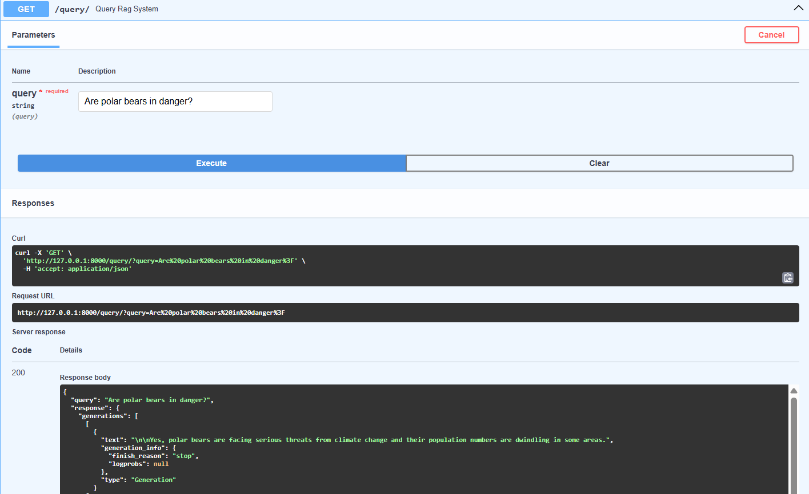

# AI Document RAG Service 🚀  
### LangChain + FastAPI + OpenAI

A simple **Retrieval-Augmented Generation (RAG)** API built using **LangChain**, **OpenAI**, and **FastAPI**.

This project demonstrates how to:

- Load and process documents  
- Split documents into chunks  
- Generate embeddings  
- Build a vector store  
- Retrieve relevant context  
- Generate answers using an LLM  
- Expose everything through a FastAPI endpoint  

---

## 📌 Features

- 📄 Document loading from `data/`
- ✂️ Chunking with `RecursiveCharacterTextSplitter`
- 🔢 OpenAI Embeddings
- 🗄 Vector Store (FAISS / Chroma)
- 🔍 Similarity-based retrieval (Top-K)
- ⚡ FastAPI REST endpoint
- 📚 Swagger UI documentation

---

```
AI-Document-RAG-Service/
│
├── data/
│   └── my_document.txt
│
├── assets/
│   └── image.png
│
├── rag.py
├── endpoints.py
├── main.py
├── requirements.txt
├── .gitignore
└── .env (NOT committed)
```

---

## ⚙️ Installation

### 1️⃣ Clone the repository

```bash
git clone https://github.com/your-username/AI-Document-RAG-Service.git
cd AI-Document-RAG-Service
```

---

### 2️⃣ Create a virtual environment (optional but recommended)

```bash
python -m venv venv
venv\Scripts\activate   # Windows
```

---

### 3️⃣ Install dependencies

```bash
pip install -r requirements.txt
```

---

### 4️⃣ Create `.env` file

Create a `.env` file in the root directory:

```env
OPENAI_API_KEY=your_openai_api_key_here
```

⚠️ Do **NOT** commit `.env` to GitHub.

---

## ▶️ Run the API

```bash
uvicorn main:app --reload
```

Open in your browser:

```
http://127.0.0.1:8000/docs
```

Swagger UI will appear.

---

## 🔎 Query Example

### Endpoint

```
GET /query/?query=Are polar bears in danger?
```

### Example curl request

```bash
curl "http://127.0.0.1:8000/query/?query=Are%20polar%20bears%20in%20danger%3F"
```

---

## 🖼 Demo Screenshot



---

## 🧠 How It Works

1. Document is loaded from `data/my_document.txt`
2. Text is split into chunks
3. Embeddings are generated using OpenAI
4. A vector store is created
5. Relevant chunks are retrieved for a query
6. LLM generates the final answer using retrieved context

---

## ⚠️ Windows OpenMP Fix (If Needed)

If you encounter this error:

```
OMP: Error #15: libiomp5md.dll already initialized
```

Run the server with:

```powershell
$env:KMP_DUPLICATE_LIB_OK="TRUE"
uvicorn main:app --reload
```

---

## 🛡 Security Note

- Never commit your `.env` file.
- Always rotate your API key if accidentally exposed.
- Add `.env` to `.gitignore`.

---
